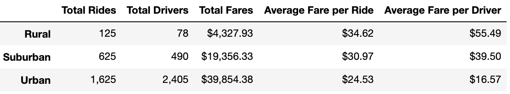

# PyBer_Analysis

Performing an exploratory analysis and creating visualizations using rideshare data to help improve access to rideshare services and determine affordability for different city types.

# Challenge

* The PyBer Summary DataFrame provides an overview comparison of PyBer's ridesharing services in three types of cities: Rural, Surburban, and Urban cities. The summary demonstrates that there is a larger demand for PyBer among riders in urban cities compared to suburban and rural cities. Between January 2019 and May 2019, there were 125 rides in rural cities, 625 rides in suburban cities, and 1,625 rides in urban cities, respectively. The figure below highlights how rides in Urban cities dominated two-thirds of PyBer's overall rides during this five-month period:

* Similarly, there was also a larger volume of drivers in urban cities compared to suburban and rural cities. There were 2,405 drivers in urban cities, 490 drivers in suburban cities, and 78 drivers in rural cities. The figure below demonstrates the significance of drivers in urban cities at 80.9%.

* We can see that there is a greater usage of PyBer in urban cities; the total fares are also higher than suburban and rural cities. PyBer transactions in urban cities totaled $39,854 whereas transactions in urban cities and rural cities totaled at least $19,356 and $4,328, respectively. The figure below demonstrates where the majority of PyBer's revenue occurred during this time period: urban cities.

* Cost-wise, it appears that riders in rural cities pay on average almost $10 more for PyBer than riders in urban cities. The average fare per ride is about $35 in rural cities whereas the average fare per ride is about $25 in urban cities. Suburban cities' average fare per ride falls just in between - at about $31. While it may not be good news for riders in rural cities, it is a better market for drivers in this type of city. The average fare per driver is about $55 in rural cities, whereas the average fare per driver is about $17 in urban cities. Suburban cities' average fare per driver is about $40.

* The multiple-line chart "Total Fare by City Type" further supports the PyBer Summary DataFrame by providing trends of total fares in rural, suburban, and urban cities between January 2019 and April 2019. The yellow trend shows how fares in urban cities totaled from around $1,600 to $2,300 from beginning to end during this five-month period. In contrast, the blue trend shows how fares in rural cities totaled around $300 from beginning to end during the same time period. The orange trend shows how the total fares in suruban cities fall in between urban and rural cities: around $700 to $1,300 from beginning to end during this time. The chart further demonstrates similar peak times in all these types of cities. One noteworthy peak in total fares among urban, suburban, and rural cities occurred sometime at the end of February 2019.

### Summary:
Below are three business recommendations to the CEO for addressing any disparities among the city types:

* The costs for using PyBer is greater among riders in rural cities than urban cities. This could discourage potential riders from using PyBer given the high average fare per ride. They could offer discounts in rural areas.
* Drivers in rural cities are earning more than drivers in urban cities. This could discourage discourage potential drivers from working with PyBer given the low average fare per driver. They could advertize more.
* There is an another opportunity for further analysis to determine other factors that are contributing to the high ride costs in rural cities and low driver fares in urban cities. Perhaps, look into driver benefits (take a look at California's Prop 22).

Overall, PyBer ridersharing services significantly differs in rural, suruban, and urban cities given the number of rides, drivers, and fares. Data supports that there is higher usage of PyBer ridesharing services in urban cities.
